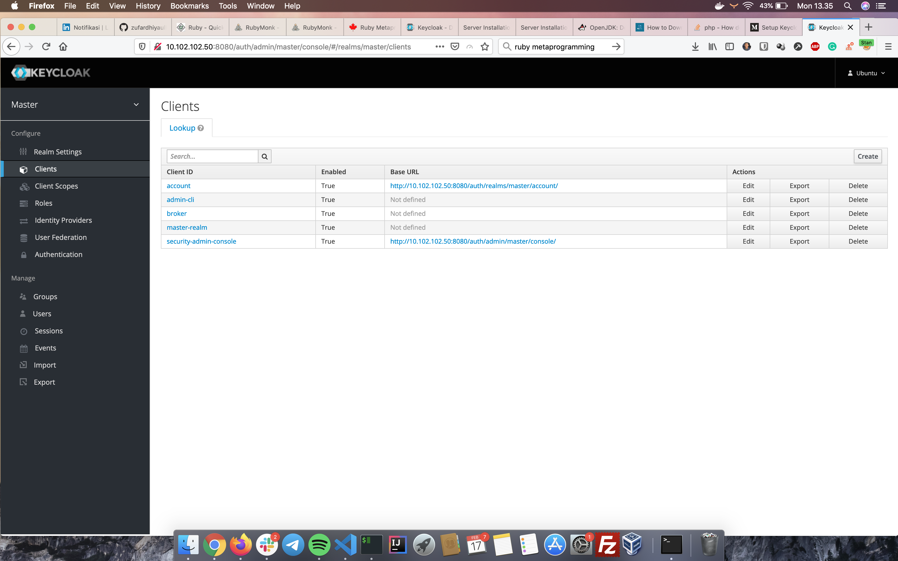
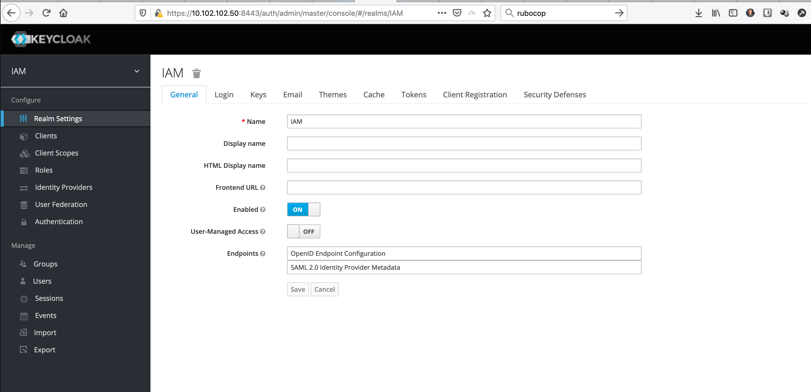

# keycloak Installation
Keycloack is Open Source Identity and Access Management that support OIDC.

### setup environment
- Ubuntu 18.04

### Installation
- Update & Upgrade
```
apt update
apt upgrade
```
- Install JDK 8
```
apt-get install openjdk-8-jdk
```
- Download keycloak
```
wget https://downloads.jboss.org/keycloak/8.0.2/keycloak-8.0.2.tar.gz
tar -xzf keycloak-8.0.2.tar.gz -C /opt/
mv /opt/keycloak-8.0.2 /opt/keycloak
```
- Create user & group keycload
```
groupadd keycloak
useradd -r -g keycloak -d /opt/keycloak -s /sbin/nologin keycloak
```
- Create service file for keycloak
```
mkdir -p /etc/keycloak
cp /opt/keycloak/docs/contrib/scripts/systemd/wildfly.conf /etc/keycloak/keycloak.conf
cp /opt/keycloak/docs/contrib/scripts/systemd/launch.sh /opt/keycloak/bin/
cp /opt/keycloak/docs/contrib/scripts/systemd/wildfly.service /etc/systemd/system/keycloak.service
```
- edit launch.sh
```
vi /opt/keycloak/bin/launch.sh

WILDFLY_HOME='/opt/keycloak/'
```
- edit keycloak service
```
vi /etc/systemd/system/keycloak.service

[Unit]
Description=The Keycloak Server
After=syslog.target network.target
Before=httpd.service

[Service]
Environment=LAUNCH_JBOSS_IN_BACKGROUND=1
EnvironmentFile=/etc/keycloak/keycloak.conf
User=keycloak
Group=keycloak
LimitNOFILE=102642
PIDFile=/var/run/keycloak/keycloak.pid
ExecStart=/opt/keycloak/bin/launch.sh $WILDFLY_MODE $WILDFLY_CONFIG $WILDFLY_BIND
StandardOutput=null

[Install]
WantedBy=multi-user.target
```
- Change permission of keycloak directory
```
chown keycloak:keycloak -R /opt/keycloak
chmod o+x /opt/keycloak/bin/
```
- reload and start
```
systemctl daemon-reload
systemctl enable keycloak
systemctl start keycloak
systemctl status keycloak
```
- Open keycloak server 
```
http://IP:8080/auth/
```
since we access from non local IP address, we can create admin user by executing
```
/opt/keycloak/bin/add-user-keycloak.sh -r master -u <username> -p <password>
systemctl restart keycloak
```


## Keycloak HTTPS
- Create folder for Certificate
```
mkdir -p /opt/kc-certificate
```
- create openssl config
```
vi /etc/ssl/openssl.cnf

# RANDFILE = $ENV::HOME/.rnd
```
- Generate CA & key
```
cd /opt/kc-certificate

openssl genrsa -out ca.key 2048

openssl req -new -x509 -key ca.key -out ca.crt -subj "/C=US/ST=CA/O=Acme, Inc./CN=*.zufar.io" 
keytool -import -file ca.crt -keystore ca.truststore -keypass PASSWORD -storepass PASSWORD

openssl genrsa -out keycloak.key 2048
openssl req -new -key keycloak.key -out keycloak.csr -subj "/C=US/ST=CA/O=Acme, Inc./CN=*.zufar.io"

openssl x509 -req -days 3650 -in keycloak.csr -CA ca.crt -CAkey ca.key -CAcreateserial -out keycloak.crt
openssl pkcs12 -export -in keycloak.crt -inkey keycloak.key -out keycloak.p12 -name myserverkeystore -CAfile ca.crt

keytool -importkeystore -deststorepass PASSWORD -destkeypass PASSWORD -destkeystore keycloak.keystore -srckeystore keycloak.p12 -srcstoretype PKCS12 -srcstorepass PASSWORD
```
if you ask for password, just add `PASSWORD`
- Copy cert
```
cp ca.truststore /opt/keycloak/standalone/configuration/
cp keycloak.keystore /opt/keycloak/standalone/configuration/

chown keycloak:keycloak -R /opt/keycloak
```
- Configure Keycloak
```
cd /opt/keycloak/
./bin/jboss-cli.sh
connect
```
```
/core-service=management/security-realm=ssl-realm:add()
/core-service=management/security-realm=ssl-realm/server-identity=ssl:add(keystore-relative-to=jboss.server.config.dir,keystore-path=keycloak.keystore, keystore-password=PASSWORD)
/core-service=management/security-realm=ssl-realm/authentication=truststore:add(keystore-relative-to=jboss.server.config.dir,keystore-path=ca.truststore, keystore-password=PASSWORD)
/subsystem=undertow/server=default-server/https-listener=https:remove()
/subsystem=undertow/server=default-server/https-listener=https:add(socket-binding=https, security-realm=ssl-realm,enable-http2=true, verify-client=REQUESTED)

reload
exit
```
- restart keycloak
```
systemctl restart keycloak
```

